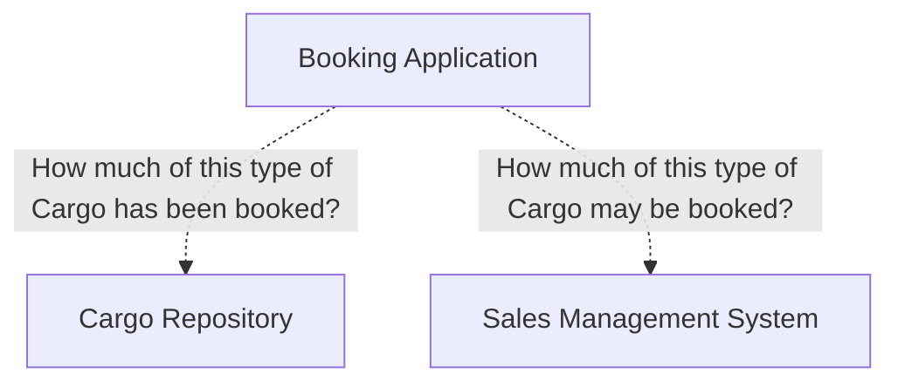

# Applications

## Tracking Query

A *Tracking Query* that can access past and present handling of a particular *Cargo*

## Booking Application

A *Booking Application* that allows a new *Cargo* to be registered and prepares the system for it.

### Allocation Checking

The sales division uses other software to manage client relationships, sales projections, and so on. One feature supports yield management by allowing the firm to allocate how much cargo of specific types they will attempt to book based on the type of goods, the origin and destination, or any other factor they may choose that can be entered as a category name. These constitute goals of how much will be sold of each type, so that more profitable types of business will not be crowded out by less profitable cargoes, while at the same time avoiding underbooking (not fully utilizing their shipping capacity) or excessive overbooking (resulting in bumping cargo so often that it hurts customer relationships).

Now they want this feature to be integrated with the booking system. When a booking comes in, they want it checked against these allocations to see if it should be accepted.

The information needed resides in two places, which will have to be queried by the *Booking Application* so that it can either accept or reject the requested booking.

## Incident Logging Application

An *Incident Logging Application* that can record each handling of the *Cargo* (providing the information that is found by the *Tracking Query*).
