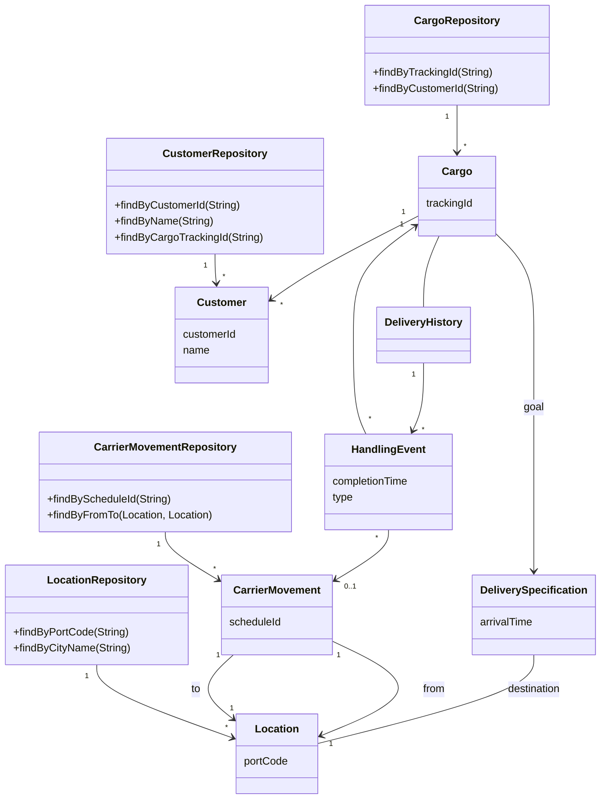

# Architecture Design

## Overview

## Basic Features

1. Track key handling of customer cargo
2. Book cargo in advance
3. Send invoices to customers automatically when the cargo reaches some point in its handling

## Applications

### Tracking Query

A *Tracking Query* that can access past and present handling of a particular *Cargo*

### Booking Application

A *Booking Application* that allows a new *Cargo* to be registered and prepares the system for it.

### Incident Logging Application

An *Incident Logging Application* that can record each handling of the *Cargo* (providing the information that is found by the *Tracking Query*).

## Entities and Value Objects

### Entities

#### Customer

A *Customer* object represents a person or a company, an entity in the usual sense of the word. The *Customer* object clearly has identity that matters to the user, so it is an ENTITY in the model. How to track it? Tax ID might be appropriate in some cases, but an international company could not use that. This question calls for consultation with a domain expert. We discuss the problem with a businessperson in the shipping company, and we discover that the company already has a customer database in which each *Customer* is assigned an ID Number at first sales contact. This ID is already used throughout the company; using the number in our software will establish continuity of identity between those systems. It will initially be a manual entry.

- **Type:** Entity
- **Identity:** Customer ID Number
- **Note:** Assigned at first sales contact from existing company database

#### Cargo

Two identical crates must be distinguishable, so *Cargo* objects are ENTITIES. In practice, all shipping companies assign tracking IDs to each piece of cargo. This ID will be automatically generated, visible to the user, and in this case, probably conveyed to the customer at booking time.

- **Type:** Entity
- **Identity:** Tracking ID
- **Note:** Automatically generated, visible to user, conveyed to customer at booking

#### Handling Event

We care about such individual incidents because they allow us to keep track of what is going on. They reflect real-world events, which are not usually interchangeable, so they are ENTITIES.

- **Type:** Entity
- **Identity:** Combination of Cargo ID, completion time, and type
- **Note:** Same Cargo cannot be both loaded and unloaded at the same time

#### Carrier Movement

Each *Carrier Movement* will be identified by a code obtained from a shipping schedule.

- **Type:** Entity
- **Identity:** Code from shipping schedule
- **Note:** Real-world events not usually interchangeable

#### Location

Two places with the same name are not the same. Latitude and longitude could provide a unique key, but probably not a very practical one, since those measurements are not of interest to most purposes of this system, and they would be fairly complicated. More likely the *Location* will be part of a geographical model of some kind that will relate places according to shipping lanes and other domain-specific concerns. So an arbitrary, internal, automatically generated identifier will suffice.

- **Type:** Entity
- **Identity:** Arbitrary, internal, automatically generated identifier

#### Delivery History

This is a tricky one. *Delivery Histories* are not interchangeable, so, they are ENTITIES. But a *Delivery History* has one-to-one relationship with its *Cargo*, so it doesn't really have an identity of its own. Its identity is borrowed from the *Cargo* that owns it. This will become clearer when we model the AGGREGATES.

- **Type:** Entity (identity borrowed from Cargo)
- **Identity:** Borrowed from associated Cargo
- **Note:** One-to-one relationship with Cargo

### Value Objects

#### Delivery Specification

Although it represents the goal of a *Cargo*, this abstraction does not depend on *Cargo*. It really expresses a hypothetical state of some *Delivery History*. We hope that the *Delivery History* attached to our *Cargo* will eventually satisfy the *Delivery Specification* attached to our *Cargo*. If we had two *Cargoes* going to the same place, they could share the same *Delivery Specification*, but they could not share the same *Delivery History*, even though the histories start out the same (empty), *Delivery Specifications* are VALUE OBJECTS.

- **Type:** Value Object
- **Note:** Does not depend on Cargo. Can be shared between Cargoes going to the same destination.

## Aggregates

*Customer*, *Location*, and *Carrier Movement* have their own identities, and are shared by many *Cargoes*, so they must be the roots of their own AGGREGATES, which contain their attribute and possibly other objects below the level of detail of this discussion.

### Customer Aggregate

*Customer* has its own identity (Customer ID Number) and is shared by many Cargoes. It is an AGGREGATE ROOT.

- **Aggregate Root:** Customer

### Location Aggregate

*Location* has its own identity (arbitrary, automatically generated identifier). It is shared by many Cargoes and Carrier Movements. It is an AGGREGATE ROOT.

- **Aggregate Root:** Location

### Carrier Movement Aggregate

*Carrier Movement* has its own identity (code from shipping schedule). It is an AGGREGATE ROOT.

- **Aggregate Root:** Carrier Movement

### Cargo Aggregate

The *Cargo* AGGREGATE sweeps in everything that would not exist but for a particular *Cargo*, which would include the *Delivery History*, the *Delivery Specification*, and the *Handling Events*.

*Delivery History* fits inside *Cargo's* boundary. No one would look up a *Delivery History* directly without wanting the *Cargo* itself. With no need for direct global access, and with an identity that is really just derived from the *Cargo*, the *Delivery History* fits nicely inside *Cargo's* boundary, and it does not need to be a root.

The *Delivery Specification* is a VALUE OBJECT, so there are no complications from including it in the *Cargo* AGGREGATE.

- **Aggregate Root:** Cargo
- **Contained:** Delivery History, Delivery Specification (Value Object)

### Handling Event Aggregate

The *Handling Event* should be the root of its own AGGREGATE. The activity for handling the Cargo has some meaning even when considered apart from the Cargo itself. It can be queried to find all the operations to load and prepare for a particular *Carrier Movement*.

- **Aggregate Root:** HandlingEvent

## Selecting Repositories

There are five ENTITIES in the design that are roots of AGGREGATES, so we can limit out consideration to these, since none of the other objects is allowed to have REPOSITORIES.

To decide which of these candidates should actually have a REPOSITORY, we must go back to the application requirements. In order to take a booking through the *Booking Application*, the user need to select *Customer(s)* playing the various roles (shipper, receiver, and so on). So we need a *Customer Repository*. We also need to find a *Location* to specify as the destination for the *Cargo*, so we create a *Location Repository*.

The *Activity Logging Application* needs to allow the user to look up the *Carrier Movement* that a *Cargo* is being loaded onto, so we need a *Carrier Movement Repository*. This user must also tell the system which *Cargo* has been loaded, so we need a *Cargo Repository*.

For now there is no *Handling Event Repository*, because we decided to implement the association with *Delivery History* as a collection in the first iteration, and we have no application requirement to find out what has been loaded onto a *Carrier Movement*. Either of these reasons could change; if they did, then we would add a REPOSITORY.

### Repositories

| Repository | Aggregate Root | Methods |
|------------|----------------|---------|
| CustomerRepository | Customer | findByCustomerId, findByName, findByCargoTrackingId |
| CargoRepository | Cargo | findByTrackingId, findByCustomerId |
| LocationRepository | Location | findByPortCode, findByCityName |
| CarrierMovementRepository | CarrierMovement | findByScheduleId, findByFromTo |

