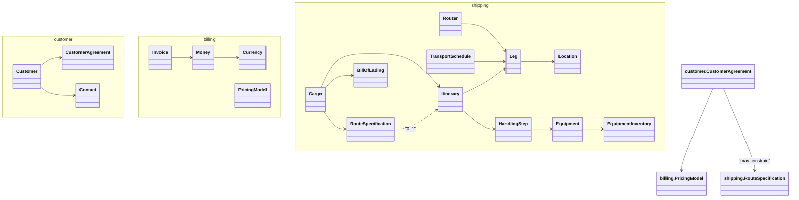

# Modules

```mermaid
classDiagram
    namespace customer {
        class Customer
        class Contact
        class CustomerAgreement
    }
    namespace billing {
        class Invoice
        class Money
        class Currency
        class PricingModel
    }
    namespace shipping {
        class Cargo
        class RouteSpecification
        class Itinerary
        class Leg
        class Location
        class TransportSchedule
        class Router
        class HandlingStep
        class Equipment
        class EquipmentInventory
        class BillOfLading
    }

    Customer --> CustomerAgreement
    Customer --> Contact
    Invoice --> Money
    Money --> Currency
    Cargo --> RouteSpecification
    RouteSpecification ..> Itinerary : "0..1"
    Itinerary --> Leg
    Leg --> Location
    TransportSchedule --> Leg
    Router --> Leg
    Itinerary --> HandlingStep
    HandlingStep --> Equipment
    Equipment --> EquipmentInventory
    Cargo --> Itinerary
    Cargo --> BillOfLading
    customer.CustomerAgreement --> billing.PricingModel
    customer.CustomerAgreement --> shipping.RouteSpecification : "may constrain"
```
