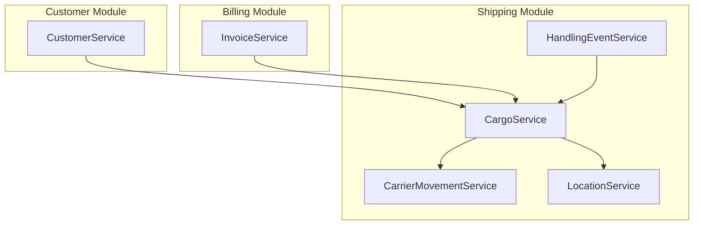

# Modules

```mermaid
graph TB
    subgraph Customer["Customer Module"]
        CustomerService
    end

    subgraph Billing["Billing Module"]
        InvoiceService
    end

    subgraph Shipping["Shipping Module"]
        CargoService
        HandlingEventService
        CarrierMovementService
        LocationService
    end

    CustomerService --> CargoService
    InvoiceService --> CargoService
    HandlingEventService --> CargoService
    CargoService --> LocationService
    CargoService --> CarrierMovementService
```
