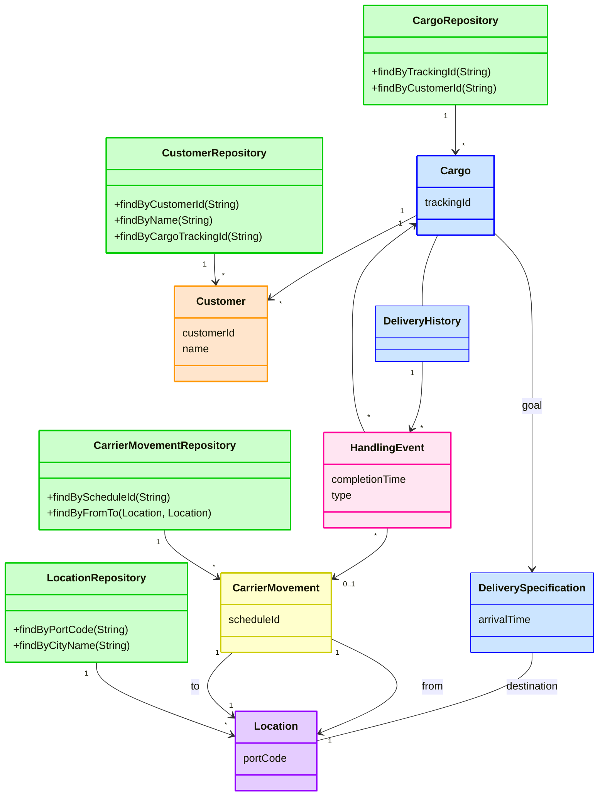

# Architecture Design

## Overview

DDD Chapter 7 - Cargo Shipping System

Domain: Shipping/Logistics
Purpose: Learning Domain-Driven Design through Cargo Shipping domain

## Basic Features

1. Track key handling of customer cargo
2. Book cargo in advance
3. Send invoices to customers automatically when the cargo reaches some point in its handling

## Domain Model Diagram

## Sections

| # | Section | Description |
|---|---------|-------------|
| 01 | Applications | Tracking Query, Booking Application, Incident Logging Application |
| 02 | Entities and Value Objects | Domain entities and value objects with descriptions |
| 03 | Aggregates | Aggregate roots and their boundaries |
| 04 | Repositories | Repository selection and methods |
